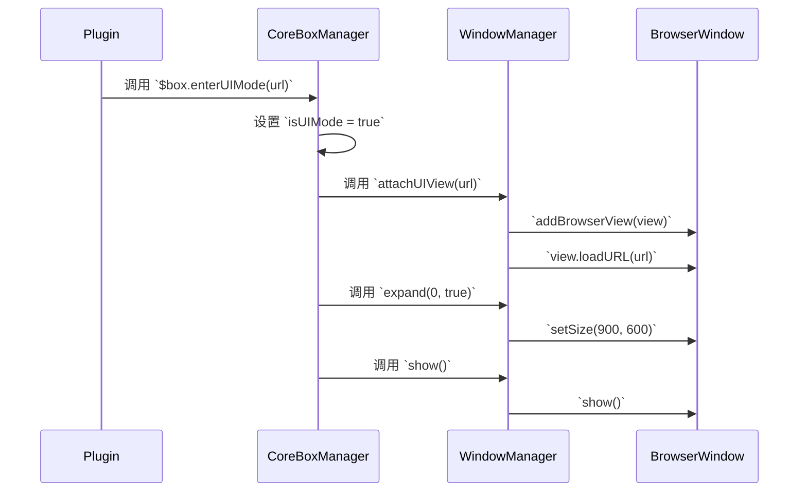

# PRD: CoreBox UI 模式

## 1. 功能概述

为 CoreBox 引入一个新的“UI 模式”。当插件或内部功能需要更丰富的交互界面时，可以触发此模式。在该模式下，CoreBox 窗口将展开，并在主输入框下方嵌入一个 `BrowserView`，用于加载指定的 HTML 内容，从而实现一个迷你的、内嵌的 Web 应用体验。

## 2. 目标与范围

### 目标

*   在主进程中实现对 `BrowserView` 的管理，包括创建、附加、分离和销毁。
*   允许通过 IPC 通道从渲染进程或插件触发进入/退出 UI 模式。
*   扩展 CoreBox 窗口以容纳 `BrowserView`。
*   为插件开发者提供简单易用的 API 来使用此功能。

### 范围外

*   本期不涉及 `BrowserView` 内部 UI 的具体实现，仅提供加载能力。
*   不涉及 `BrowserView` 与主窗口渲染器之间复杂的自定义通信（可后续扩展）。

## 3. 技术方案

### 3.1. 主进程 (Main Process) 伪代码

#### `apps/core-app/src/main/modules/box-tool/core-box/window.ts`

```typescript
// 引入 BrowserView
import { app, screen, BrowserView } from 'electron';

export class WindowManager {
  // ... 其他属性
  private uiView: BrowserView | null = null;

  // ... 其他方法

  public expand(length: number = 100, isUIMode: boolean = false): void {
    const height = isUIMode ? 600 : Math.min(length * 48 + 65, 550);

    const currentWindow = this.current;
    if (currentWindow) {
      currentWindow.window.setMinimumSize(900, height);
      currentWindow.window.setSize(900, height);

      // 如果是 UI 模式，调整 BrowserView 的大小
      if (this.uiView) {
        const bounds = currentWindow.window.getBounds();
        this.uiView.setBounds({
          x: 0,
          y: 60, // 主输入框的高度
          width: bounds.width,
          height: bounds.height - 60
        });
      }
    }
  }

  public shrink(): void {
    // 在收缩时，确保分离并销毁 BrowserView
    this.detachUIView();

    const currentWindow = this.current;
    if (currentWindow) {
        // ... 原有逻辑
    }
  }

  // 新增方法：附加 UI 视图
  public attachUIView(url: string): void {
    const currentWindow = this.current;
    if (!currentWindow) { return; }

    if (this.uiView) { this.detachUIView(); }

    this.uiView = new BrowserView();
    currentWindow.window.addBrowserView(this.uiView);

    const bounds = currentWindow.window.getBounds();
    this.uiView.setBounds({ x: 0, y: 60, width: bounds.width, height: bounds.height - 60 });
    this.uiView.webContents.loadURL(url);
  }

  // 新增方法：分离 UI 视图
  public detachUIView(): void {
    if (this.uiView) {
      const currentWindow = this.current;
      if (currentWindow && !currentWindow.window.isDestroyed()) {
          currentWindow.window.removeBrowserView(this.uiView);
      }
      // @ts-ignore
      this.uiView.webContents.destroy();
      this.uiView = null;
    }
  }
}
```

#### `apps/core-app/src/main/modules/box-tool/core-box/manager.ts`

```typescript
export class CoreBoxManager {
  // ... 其他属性
  private isUIMode: boolean = false;
  private uiViewUrl: string | null = null;

  // ... 其他方法

  public trigger(show: boolean): void {
    // ...
    if (show) {
      if (this.isUIMode && this.uiViewUrl) {
        windowManager.attachUIView(this.uiViewUrl);
        windowManager.expand(0, true);
      } else if (!this._expand) {
        windowManager.shrink();
      } else {
        windowManager.expand(this._expand);
      }
      windowManager.show();
    } else {
      windowManager.hide();
    }
  }

  // 新增方法：进入 UI 模式
  public enterUIMode(url: string): void {
    this.isUIMode = true;
    this.uiViewUrl = url;
    this.trigger(true); // 显示并展开窗口
  }

  // 新增方法：退出 UI 模式
  public exitUIMode(): void {
    this.isUIMode = false;
    this.uiViewUrl = null;
    windowManager.detachUIView();
    this.shrink(); // 恢复到默认大小
  }
}
```

### 3.2. 进程间通信 (IPC)

#### `apps/core-app/src/main/modules/box-tool/core-box/ipc.ts`

```typescript
export class IpcManager {
  // ...

  public register(): void {
    // ... 其他 IPC 通道

    // 新增：进入 UI 模式
    this.touchApp.channel.regChannel(ChannelType.MAIN, 'core-box:enter-ui-mode', ({ data }) => {
      const { url } = data as { url: string };
      if (url) {
        coreBoxManager.enterUIMode(url);
      }
    });

    // 新增：退出 UI 模式
    this.touchApp.channel.regChannel(ChannelType.MAIN, 'core-box:exit-ui-mode', () => {
      coreBoxManager.exitUIMode();
    });
  }
}
```

### 3.3. 插件 API

#### `apps/core-app/src/main/plugins/plugin-core.ts`

```typescript
export class TouchPlugin implements ITouchPlugin {
    // ...

    getFeatureUtil(): any {
        // ...
        return {
            // ... 其他工具
            $box: {
                hide() {
                  CoreBoxManager.getInstance().trigger(false)
                },
                show() {
                  CoreBoxManager.getInstance().trigger(true)
                },
                // 新增 API
                enterUIMode(url: string) {
                    if (!url.startsWith('http') && !url.startsWith('file')) {
                        console.error('[Plugin] Invalid URL for UI Mode. Must be http or file protocol.');
                        return;
                    }
                    CoreBoxManager.getInstance().enterUIMode(url);
                },
                exitUIMode() {
                    CoreBoxManager.getInstance().exitUIMode();
                }
            }
        }
    }
}
```

## 4. 工作流程图



## 5. 待办事项

- [ ] **主进程**: 在 `WindowManager` 中实现 `attachUIView` 和 `detachUIView` 方法。
- [ ] **主进程**: 修改 `WindowManager` 的 `expand` 和 `shrink` 方法以适应 UI 模式。
- [ ] **主进程**: 在 `CoreBoxManager` 中添加 `isUIMode` 状态和 `enterUIMode`/`exitUIMode` 方法。
- [ ] **IPC**: 在 `IpcManager` 中注册 `core-box:enter-ui-mode` 和 `core-box:exit-ui-mode` 通道。
- [ ] **插件**: 在 `plugin-core.ts` 中为插件暴露 `$box.enterUIMode` 和 `$box.exitUIMode` API。
- [ ] **测试**: 创建一个简单的插件和 HTML 页面来端到端测试整个功能。